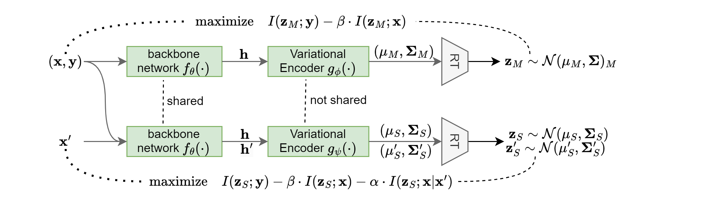

# InfoR-LSF (Information Retention via Learning Supplemental Features)

This is the implementation of the paper [Information Retention via Learning Supplemental Features](https://openreview.net/pdf?id=o83eu4H9Mb).

## Quick links

- [InfoR-LSF (Information Retention via Learning Supplemental Features)](#infor-lsf-information-retention-via-learning-supplemental-features)
  - [Quick links](#quick-links)
  - [Overview](#overview)
  - [Requirements](#requirements)
  - [Prepare the data](#prepare-the-data)
  - [Run InfoR-LSF](#run-infor-lsf)
    - [Run NLP tasks](#run-nlp-tasks)
  - [Bugs or questions?](#bugs-or-questions)
  - [Citation](#citation)

## Overview



We propose the information retention principle that favors using as much relevant information as possible in supervised learning. To alleviate the problem of feature suppression, we develop a three-stage process for information retention via learning supplemental features.

## Requirements

To run our code, please install all the dependency packages by using the following command:

```
pip install -r requirements.txt
```

**NOTE**: Different versions of packages (like `pytorch`, `transformers`, etc.) may lead to different results from the paper.

## Prepare the data

For CV tasks

- The dataset CIFAR10 and CIFAR100 will be automatically downloaded when the code is running.

For NLP tasks,
<!-- - download the GLUE data from https://github.com/nyu-mll/GLUE-baselines, this include SNLI, MNLI, RTE, MRPC, STS-B -->
- download IMDB dataset from https://github.com/allenai/sledgehammer

- download yelp datasets from https://github.com/jiacheng-xu/vmf\_vae\_nlp/tree/master/data

- For Amazon-2 Amazon-5 Yelp-2, run

    ```bash
    mkdir ./data/original
    python tools/download_dataset.py
    ```

- For SST-2, SST-5, MR, STS-B, you can find at https://nlp.cs.princeton.edu/projects/lm-bff/datasets.tar. Please download it and extract the files to `./data/original`

- Move all dataset to `./data/original` as `./data/original/$task/` and there should be `train dev test` file in this dir.

- To generate low-resource subset, use the following command (in the root directory) to generate the low-resource data we need:

    ```bash
    for k in 50 100 200 500 1000
    do
    python tools/generate_k_shot_data.py --k $k --task imdb yelp STS-B
    done
    ```

    See `tools/generate_k_shot_data.py` for more options. The low-resource data will be generated to `data/original/$task/sampled_datasets/`. In the directory of each dataset, there will be folders named as `seed_$SEED/$k` indicating different dataset samples.

## Run InfoR-LSF

### Run NLP tasks
Our code is built on [transformers](https://github.com/huggingface/transformers) and we use its `3.4.0` version. Other versions of `transformers` might cause unexpected errors.

Before running any experiments, change work dir to nlp by `cd nlp`,   create the result folder by `mkdir results` and log folder by `mkdir logs` to save results and logs. Then you can run our code with the following example:

```bash
bash scripts/run.sh $task
```

the script will run following methods:
* baseline
* IFM
* VIBERT
* InfoR-LSF

see `scripts/run.sh` for more details

For single run, use

```bash
python run_glue.py \
    --model_name_or_path bert-base-uncased \
    --output_dir output/low_resource/$task/irlsf/trainSize$num_samples/seed$data_seed --task_name $task \
    --model_type bert \
    --do_eval \
    --max_seq_length $max_seq_length \
    --num_train_epochs 25 \
    --overwrite_output_dir \
    --outputfile results/inforetention_wozaugsup_withdev_results.csv \
    --do_lower_case \
    --learning_rate 2e-5 \
    --per_gpu_train_batch_size 8 \
    --do_train \
    --sample_train \
    --num_samples $num_samples \
    --ib_dim 384 \
    --beta 1e-05 \
    --ib \
    --kl_annealing linear \
    --eval_types train dev \
    --seed 42 \
    --data_seed $data_seed \
    --evaluate_after_each_epoch \
    --debug $debug_mode \ 
    --log_file $log_file \ 
    --disable_wandb \
    --local_params '{"sup_loss_on_z_":false,"InfoRetention":true,"ir_beta":'$ir_beta',"multi_stages":true,"ifm_epsilon":0.1,"z_perc_or_num":1.0,"mi_type":"lower_bound","x_perc_or_num":'$x_perc_or_num',"mask_type":"token_mask","only_mask_correct":false}'
```

Most arguments are literal and easy to understand. We further explain some of the InfoR-LSF's arguments:

* `sample_train`: use low-resource setting
* `num_samples`: sample num in low-resource setting
* `ib_dim`: dimension after variational encoder
* `beta`: bete in paper, information bottleneck regularization cofficient
* `ib`: if True, use variational encoder
* `debug`: the model, log and results will not be saved in debug mode.
* `disable_wandb`: disable wandb
* `ir_beta`: alpha in paper, information retention regularization cofficient
* `ifm_epsilon`: epsilon for IFM
* `x_perc_or_num`: mask ratio of the input

## Bugs or questions?

If you have any questions related to the code or the paper, feel free to contact [email](yaheli21@m.fudan.edu.cn). If you encounter any problems when using the code, or want to report a bug, you can open an issue. Please try to specify the problem with details so we can help you better and quicker!

## Citation

Please cite our paper if you use InfoR-LSF in your work:

```bibtex
@inproceedings{xie2024information,
   title={Information Retention via Learning Supplemental Features},
   author={Xie, Zhipeng and Li, Yahe},
   booktitle={ICLR},
   year={2024}
}
```
